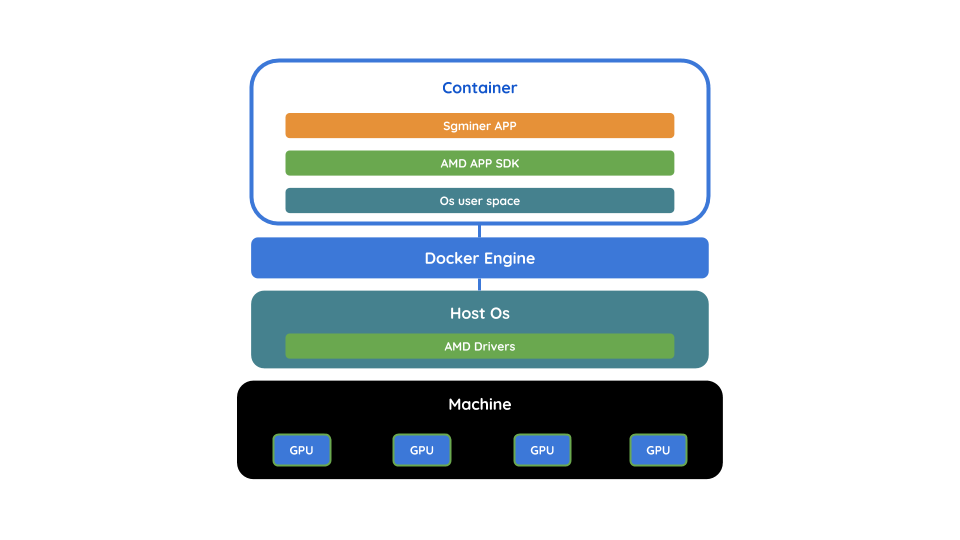

# **Docker Sgminer AMD64**

This **Dockerfile** is related to this **docker** image:

+ [gcamerli/sgminer](https://hub.docker.com/r/gcamerli/sgminer/)

### **Requirements**

You must download and put inside the the same folder of the **Dockerfile** to build:

+ [AMD APP SDK (Linux 64-bit)](http://developer.amd.com/amd-accelerated-parallel-processing-app-sdk/)

### **Shell scripts**

To automate the operations with **docker** you can use:

+ [build.sh](script/build.sh)
+ [test.sh](script/test.sh)
+ [run.sh](script/run.sh)
+ [stop.sh](script/stop.sh)
+ [clean.sh](script/clean.sh)
+ [remove.sh](script/remove.sh)

### **How it works**

This scheme describes how the docker **container** is assembled to use **AMD GPU**s.

### **GPL License**

This work is licensed under the terms of **[GNU General Public License v3.0](https://www.gnu.org/licenses/gpl.html)**.
